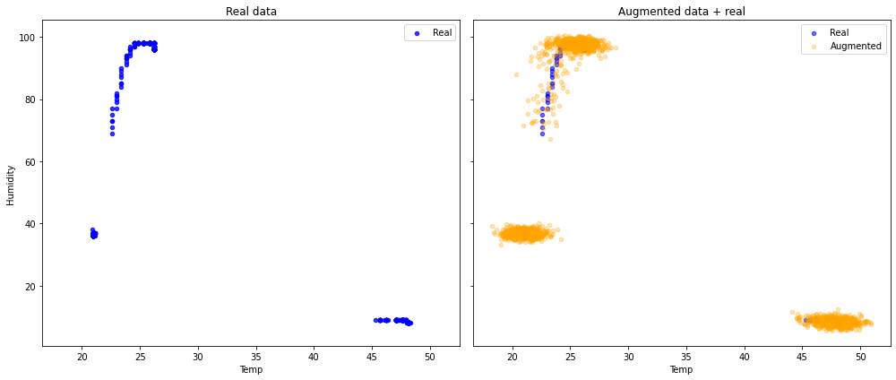
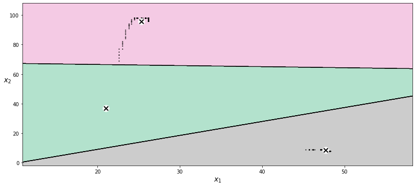
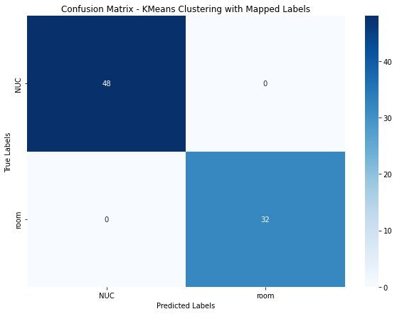

# Data Analytis

The notebook attached implements a k-means classifier based on temperature and humidity measured. It combines data visualization methods and machine learning to predict sensor location :

- In the room
- In the bathroom (humidity increases a lot)
- Behind a NUC PC (humidity drops down to low level and temperature increases a lot)

 ### Dataset visualization 

  

### K-means algorithm for clustering and decision boundaries

  
 

### Conf matrix 

  

