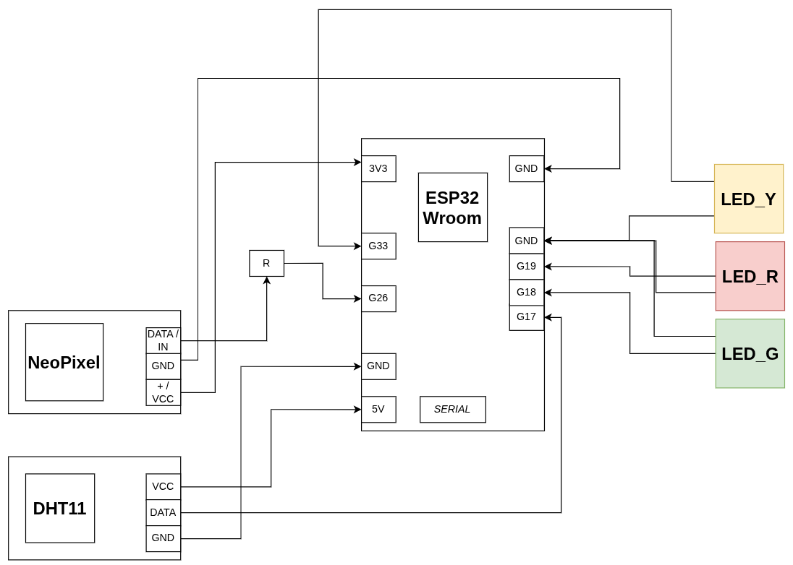
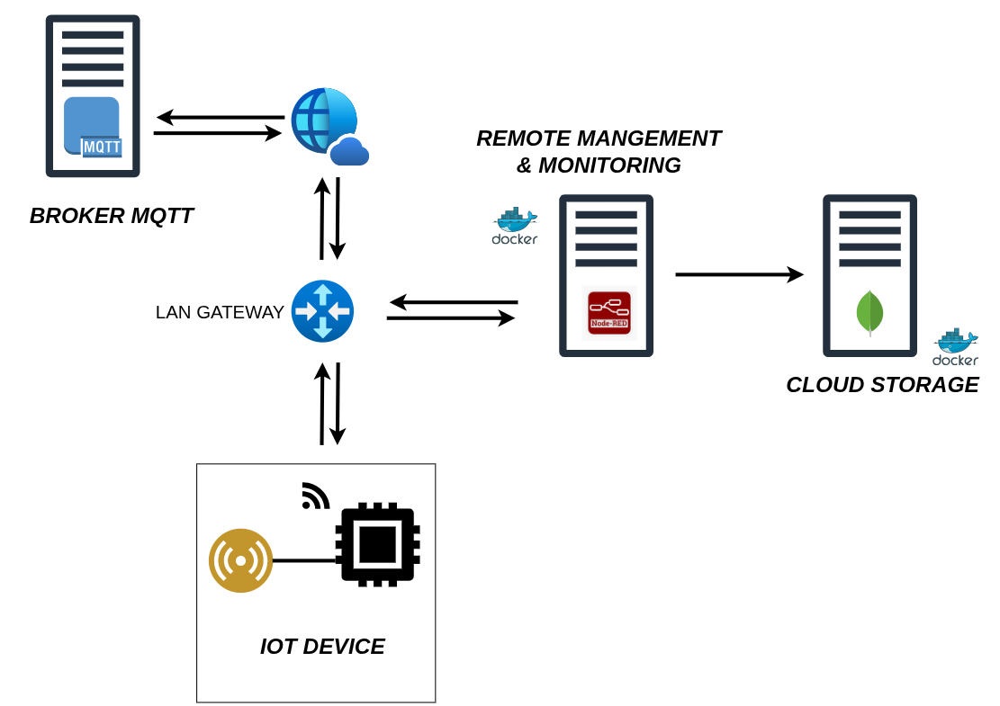

# Weather condition measurement with home-made IOT sensor

This project is implements/builds of home-made IOT sensor used to measure temperature and humidity. Below is the stack and hardware used to do so:

**[Hardware]**
- ESP-Wroom-32 Microcontroller
- DHT11 sensor
- 3PINS NeoPixel
- 3 LEDs (yellow, red and green)

**[Stack]**
- Nodered (Docker)
- Mongodb (Docker)
- HiveMQ MQTT Broker (Public)
- ArduinoIDE 

